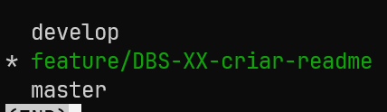
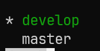

# gitflow-play
Link oficial: [https://danielkummer.github.io/git-flow-cheatsheet/](https://danielkummer.github.io/git-flow-cheatsheet/)


Conventional commits: [https://www.conventionalcommits.org/en/v1.0.0](https://www.conventionalcommits.org/en/v1.0.0)

```bash
sudo apt install git-flow

# Inicialize o gitflow (1x por projeto) e responda algumas perguntas...
git flow init
> [basta dar enter para todas as perguntas] - usar o default

# Criar novo recurso (feature)
git flow feature start DBS-XX-criar-readme

# O comando acima cria um novo branch chamado 'feature/DBS-XX-criar-readme', baseado 
# no branch 'develop'. Ele também já faz o checkout pra esse novo branch.

# Commits (conventional commit)
git add file-name  (ou .)
git commit -m "feature(DBS-XX): add readme file"
git commit -m "feat(DBS-XX): add changelog"

# Ao finalizar sua task (boa prática), publique o seu branch e abra o PR:
git flow feature publish DBS-XX-criar-readme

# ATENÇÃO!!!
# Em algumas empresas você NÃO USA o comando para finalizar a feature:
git flow feature finish DBS-XX-criar-readme # CUIDADO!!!

# Geralmente, aguarda-se aceitar a PR, ai você simplesmente da um
git pull # na branch 'develop'
```

### Gitflow - Finalizando uma feature (NÃO APLICÁVEL EM ALGUMAS EMPRESAS)

Atualmente, os seus branches vão estar assim:



Caso queira finalizar, basta digitar:

```bash
git flow feature finish DBS-XX-criar-readme

# Após digitar esse comando:
# 1. O branch 'feature/DBS-XX-criar-readme' é mergeado no branch 'develop'
# 2. O branch 'feature/DBS-XX-criar-readme' é excluído localmente
# 3. Você voltará automaticamente para o branch 'develop'
```



Bastaria pushar o branch develop (mas não é uma boa prática já que, geralmente, o branch develop também pode ser usado em ambientes de homologação).

- O ideal é sempre pushar o branch `DBS-XX-nome-da-tarefa` para a origin e abrir uma nova PR.

### Tipos de flows (branches):

```bash
# Para criação de novos recursos
git flow feature start DBS-XX-nome-da-tarefa

# Para correção de problemas (bugfix)
git flow bugfix start DBS-XX-nome-da-tarefa

# Criando correção de problemas (hotfix)
git flow hotfix start VERSION [BASENAME]

# Finalizando correção de problemas (hotfix)
git flow hotfix finish VERSION
```

### Fazendo merge de outro branch remoto para o seu branch local atual:

```bash
# 1. Atualize a origem
git fetch origin

# 2. Vá para o seu branch (caso ainda não esteja)
git checkout feature/DBS-XX-branch-que-vai-receber-o-merge

# 3. Faça o merge do branch remoto
git merge origin/feature/DBS-XX-branch-com-as-novidades
```

### Dicas adicionais
```bash
# Trazer uma feature publicada por outro desenvolvedor
git flow feature pull origin DBS-XX-nome-do-branch

# Para rastrear um branch na origem (origin)
git flow feature track DBS-XX-nome-do-branch

# Criar uma nova release
git flow release start v1.x.x


# Publicar release criada
git flow release publish v1.x.x

# Rastrear release na origem (origin)
git flow release track v1.x.x

# Finalizando a release
git flow release finish v1.x.x
git push origin --tags


# Excluíndo um branch remoto
git push origin -d feature/DBS-XX-nome-do-branch
```

